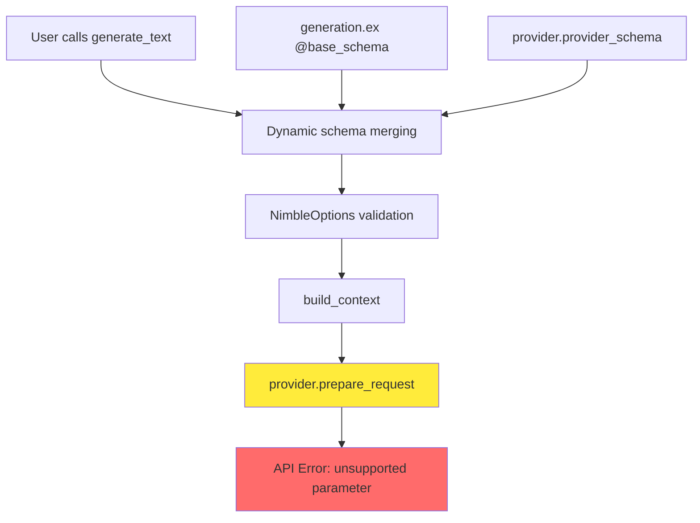
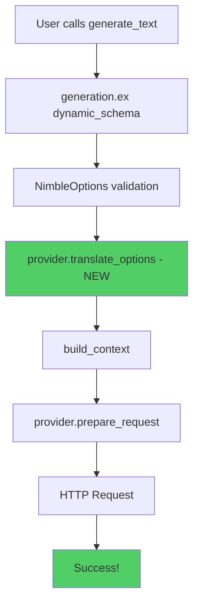

# Provider Options Architecture Refinement

## Problem Summary

ReqLLM's current options architecture needs parameter translation to handle provider-specific requirements that cause API failures:

1. **OpenAI o1 models** require `max_completion_tokens` instead of `max_tokens`
2. **Model-specific limitations** like o1 models not supporting `temperature`
3. **No parameter translation layer** between canonical options and provider APIs

The current architecture is actually well-designed with clean separation, but it lacks a parameter translation step.

## Current Architecture Analysis



**Current Strengths**: 
- Clean separation: `generation.ex` has base schema, providers have their own schema
- Good DSL for provider registration and metadata
- Comprehensive `provider/options.ex` with all known options
- Dynamic schema merging works well

**Missing Piece**: Parameter translation layer before API calls

## Proposed Solution: Extend Provider Behavior

### 1. Architecture Overview



**Clean**: Leverage existing architecture + add parameter translation step.

### 2. Extend Provider Behavior 

Instead of creating new modules, we extend the existing `ReqLLM.Provider` behavior with a new optional callback:

#### A. Add `translate_options/3` to Provider Behavior

**File**: `lib/req_llm/provider.ex` (extend existing)

```elixir
@doc """
Translates canonical options to provider-specific parameters.

This callback allows providers to modify option keys and values before
they are sent to the API. Useful for handling parameter name differences
and model-specific restrictions.

## Parameters

  * `operation` - The operation type (:chat, :embed, etc.)  
  * `model` - The ReqLLM.Model struct
  * `opts` - Canonical options after validation

## Returns

  * `{opts, warnings}` - Translated options and any warning messages

## Examples

    # OpenAI o1 models need max_completion_tokens instead of max_tokens
    def translate_options(:chat, %Model{model: <<"o1", _::binary>>}, opts) do
      {opts, warnings} = translate_max_tokens(opts)
      {opts, warnings}
    end

"""
@callback translate_options(operation(), ReqLLM.Model.t(), keyword()) :: 
  {keyword(), [String.t()]}

# Add to @optional_callbacks
@optional_callbacks [extract_usage: 2, default_env_key: 0, translate_options: 3]
```

#### B. Update Provider DSL for Helper Functions

**File**: `lib/req_llm/provider/dsl.ex` (extend existing)

Add helper functions to the DSL for common translation patterns:

```elixir
# Add this inside the __before_compile__ macro
quote do
  # ... existing code ...

  # Translation helper functions available to all providers
  @doc false
  def translate_rename(opts, from, to) when is_atom(from) and is_atom(to) do
    case Keyword.pop(opts, from) do
      {nil, opts} -> {opts, []}
      {value, opts} -> {[{to, value} | opts], []}
    end
  end

  @doc false
  def translate_drop(opts, key, msg \\ nil) do
    {_, opts} = Keyword.pop(opts, key)
    warnings = if msg, do: [msg], else: []
    {opts, warnings}
  end

  @doc false
  def translate_combine_warnings(results) do
    {final_opts, all_warnings} = 
      Enum.reduce(results, {[], []}, fn {opts, warnings}, {acc_opts, acc_warns} ->
        {Keyword.merge(acc_opts, opts), acc_warns ++ warnings}
      end)
    {final_opts, all_warnings}
  end
end
```

#### C. OpenAI Provider Implementation

**File**: `lib/req_llm/providers/openai.ex` (extend existing)

```elixir
# Add this implementation to the existing OpenAI provider
@impl ReqLLM.Provider
def translate_options(:chat, %ReqLLM.Model{model: <<"o1", _::binary>>}, opts) do
  # O1 models: rename max_tokens and drop temperature
  results = [
    translate_rename(opts, :max_tokens, :max_completion_tokens),
    translate_drop(opts, :temperature, "OpenAI o1 models do not support :temperature – dropped")
  ]
  translate_combine_warnings(results)
end

def translate_options(_action, _model, opts), do: {opts, []}
```

#### D. Update Generation Module

**File**: `lib/req_llm/generation.ex` (minimal change)

```elixir
def generate_text(model_spec, messages, opts \\ []) do
  with {:ok, model} <- Model.from(model_spec),
       {:ok, provider_module} <- ReqLLM.provider(model.provider),
       schema = dynamic_schema(provider_module),
       {:ok, validated_opts} <- NimbleOptions.validate(opts, schema),
       # NEW: Add translation step
       {translated_opts, warnings} <- translate_provider_options(provider_module, :chat, model, validated_opts),
       :ok <- handle_warnings(translated_opts, warnings),
       context = build_context(messages, translated_opts),
       {:ok, configured_request} <-
         provider_module.prepare_request(:chat, model, context, translated_opts),
       {:ok, %Req.Response{body: decoded_response}} <- Req.request(configured_request) do
    Response.decode_response(decoded_response, model)
  end
end

# Private helper
defp translate_provider_options(provider_mod, operation, model, opts) do
  if function_exported?(provider_mod, :translate_options, 3) do
    provider_mod.translate_options(operation, model, opts)
  else
    {opts, []}  # No translation needed
  end
end

defp handle_warnings(opts, warnings) do
  case opts[:on_unsupported] || :warn do
    :ignore -> :ok
    :warn -> Enum.each(warnings, &Logger.warning/1)  
    :error -> if warnings != [], do: {:error, {:unsupported_options, warnings}}, else: :ok
  end
end
```

### 3. Benefits of This Approach

**Why This is Better Than Creating New Modules:**

1. **Leverages Existing Architecture**: Uses the well-designed Provider behavior and DSL
2. **Minimal Changes**: Only adds one optional callback to existing providers
3. **Backward Compatible**: All existing code works unchanged
4. **Co-located Logic**: Translation logic lives in the same provider file as other provider logic  
5. **Reuses Infrastructure**: Provider registration, metadata, schemas all work as-is
6. **Clean Extension**: Follows the existing pattern of optional callbacks (like `extract_usage/2`)

**Current Schema Validation is Good**: The `generation.ex` + `provider.provider_schema()` pattern works well. We just add a translation step after validation.

### 4. Implementation Phases & Migration

#### Phase 1: Extend Provider Behavior  
1. Add `translate_options/3` callback to `ReqLLM.Provider` behavior
2. Add translation helper functions to `ReqLLM.Provider.DSL`
3. Add `on_unsupported` option to `generation.ex` base schema
4. Update `Generation` module to call translation step

#### Phase 2: Implement OpenAI Translation
1. Add `translate_options/3` implementation to OpenAI provider for o1 models
2. Test against real OpenAI o1 models
3. Verify no regressions in existing OpenAI functionality

#### Phase 3: Add Warning Support
1. Implement warning handling logic in `generation.ex`
2. Add Logger dependency if not already present
3. Test warning messages and error handling

### 5. Testing Strategy

#### A. Unit Tests for Translation
```elixir
test "OpenAI provider translates o1 model parameters correctly" do
  opts = [max_tokens: 1000, temperature: 0.7]
  model = %ReqLLM.Model{model: "o1-mini", provider: :openai}
  
  {translated, warnings} = 
    ReqLLM.Providers.OpenAI.translate_options(:chat, model, opts)
  
  assert translated[:max_completion_tokens] == 1000
  refute Keyword.has_key?(translated, :max_tokens)
  refute Keyword.has_key?(translated, :temperature)
  assert warnings == ["OpenAI o1 models do not support :temperature – dropped."]
end

test "OpenAI provider leaves other models unchanged" do
  opts = [max_tokens: 1000, temperature: 0.7]
  model = %ReqLLM.Model{model: "gpt-4o", provider: :openai}
  
  {translated, warnings} = 
    ReqLLM.Providers.OpenAI.translate_options(:chat, model, opts)
  
  assert translated == opts
  assert warnings == []
end
```

#### B. Helper Function Tests  
```elixir
test "translate_rename helper works correctly" do
  opts = [max_tokens: 100, temperature: 0.7]
  {result, warnings} = ReqLLM.Providers.OpenAI.translate_rename(opts, :max_tokens, :max_completion_tokens)
  
  assert result[:max_completion_tokens] == 100
  refute Keyword.has_key?(result, :max_tokens)
  assert result[:temperature] == 0.7
  assert warnings == []
end

test "translate_drop helper works correctly" do
  opts = [temperature: 0.7, max_tokens: 100]
  {result, warnings} = ReqLLM.Providers.OpenAI.translate_drop(opts, :temperature, "dropped")
  
  refute Keyword.has_key?(result, :temperature)
  assert result[:max_tokens] == 100
  assert warnings == ["dropped"]
end
```

#### C. Integration Tests
```elixir
test "generate_text works with o1 models after translation" do
  {:ok, response} = Generation.generate_text("openai:o1", "Hello", max_tokens: 100)
  assert %Response{} = response
end
```

### 6. Backward Compatibility

- **100% backward compatible** - All existing code works unchanged
- **Transparent to users** - Same API, just works better with o1 models
- **Optional callback** - Providers that don't need translation don't implement it
- **Existing schemas preserved** - Provider schemas continue to work as-is

### 7. Why This Approach is Clean & Maintainable

- **Minimal changes** - Only one new callback, leverages existing infrastructure
- **Co-located logic** - Translation logic lives with provider implementation
- **Follows existing patterns** - Uses same optional callback pattern as `extract_usage/2`
- **No architectural changes** - Schema validation remains the same
- **Easy to extend** - Just add `translate_options/3` to any provider that needs it

### 8. Usage Example (Completely Transparent)

```elixir
# User code - exactly the same as today
Generation.generate_text(
  "openai:o1-mini", 
  "Hello world!",
  max_tokens: 200,
  temperature: 0.7          # Will be dropped with warning
)

# Behind the scenes:
# 1. generation.ex dynamic_schema - existing validation
# 2. NimbleOptions.validate - existing validation  
# 3. provider.translate_options - NEW translation step
# 4. Request sent: [max_completion_tokens: 200] + warning about temperature
```

### 9. Architecture Benefits

#### Before (Missing Translation)
- Schema validation works well
- Provider patterns established
- But no parameter translation layer
- API calls fail with unsupported parameters

#### After (Add Translation Layer)  
- **Same good architecture** - keep what works
- **Add one translation step** - after validation, before request
- **Co-located in providers** - translation logic with provider implementation
- **Minimal surface area** - just one optional callback

### 10. Success Metrics

1. **Issue #8 resolved**: OpenAI o1 models work with `max_tokens` parameter
2. **Zero breaking changes**: All existing user code continues to work
3. **Minimal implementation** - Only need to modify 3 files (provider.ex, dsl.ex, generation.ex) + add OpenAI implementation
4. **Easy extensibility**: Other providers can add translation as needed
5. **Transparent to users**: Same API, better compatibility

---

## Next Steps

1. **Review this approach** - Confirm extending Provider behavior is the right direction
2. **Implement Provider callback** - Add `translate_options/3` to `ReqLLM.Provider` behavior
3. **Add DSL helpers** - Add translation helper functions to `ReqLLM.Provider.DSL`  
4. **Update Generation** - Add translation step in `generate_text/3`
5. **Implement OpenAI translation** - Add o1 model parameter handling
6. **Test with real APIs** - Verify o1 models work and no regressions

This approach leverages the existing well-designed architecture while solving the immediate parameter translation need with minimal changes and maximum backward compatibility.
